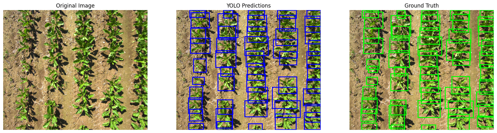

# 2nd ACCO/Fendt AI Challenge – Sugar Beet Detection

This repository contains the solution developed for the 2nd ACCO/Fendt AI Challenge, a student competition organized by AGCO/Fendt. The goal was to build an AI-based system for detecting sugar beet plants on images in an agricultural context.

## 🧠 What was the challenge?

Participants were provided with 300 labeled images. The task was to build an object detector capable of distinguishing sugar beet plants from weeds or background. The solution needed to be:

- Lightweight and efficient  
- Reliable in several outdoor agricultural conditions  
- Interpretable and easy to integrate into existing systems  

## 🌱 Motivation

- Support sustainable agriculture through smart automation  
- Reduce the need for chemical herbicides via precise weed detection: chemicals can be applied only where necessary or weeds can be removed mechanically  
- Improve plant care through early and accurate identification  

## 🔍 Key aspects of the solution

- **Data Preprocessing**: Around 25 diverse and potentially misleading test images were removed from the dataset to test the model 
- **Augmentation Testing**: Various augmentation methods were applied and compared, including Albumentations, YOLO's built-in augmentation, and a combination of both  
- **Image Resolution**: Training was conducted with relatively high-resolution images, which increased inference time (~1s) but improved the detection accuracy remarkably
- **Model Selection**: several models were trained. The final model was chosen based on the best performance metrics and visual validation of predictions

## 📊 Model Specifications:

- **YOLOv11**: The latest YOLO version (yolo11l.pt) was used, trained on the data set
- **Data Separation**: 80% training data (220 pictures) and 20% validation data (55 pictures), separated randomly
- **mAP@50**: 0.9450
- **mAP@50-95**: 0.7605
- **Inference Speed**: ~0.1072s per image

## 📸 Some detection examples

## 💡 What We learned

- Deepened our understanding of computer vision and convolutional neural networks (CNNs)  
- Gained experience in dataset handling and preprocessing techniques  
- Learned how to evaluate model performance in a meaningful way  
- Understood challenges specific to AI in agriculture (e.g., lighting conditions, plant variability, limited data)  

## 📁 Structure

- **YOLO\YoloSugarbeetDetector.ipynb**: builds data structure  which is mandatory for yolo, trains and applies the model
- **YOLO_kFoldCrossValidation\YoloSugarbeetDetectorWithCrossValidation.ipynb**: same as YoloSugarbeetDetector.ipynb but with k-fold cross validation
- **finalModel\evaluation.py**: evaluates the model (provided by ACCO/Fendt)
- **finalModel\inference.py**: applies the model (provided by ACCO/Fendt but customized for our model)
- **finalModel\testTheModel.ipynb**: applies the final model with our test data set

